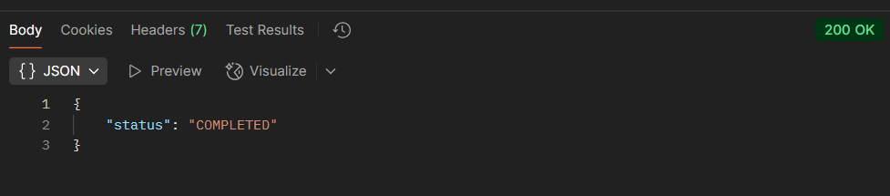

# Image-Challenge

## Solution

The developed solution is a Node.js application with TypeScript that handles the reception, processing, and storage of images, based on a microservices architecture using RabbitMQ messaging. The application receives images through an HTTP route and stores them in a temporary folder (`tmp`). Then, a message is sent to a RabbitMQ queue, which triggers a service responsible for processing the image and generating optimized versions saved in the `output` folder.

Metadata persistence and image processing state control are handled with MongoDB. Both the application and the supporting services (RabbitMQ and MongoDB) can be easily run using Docker, simplifying environment setup and execution.

## Architecture

This project follows a **3-Tier architecture** pattern, structured into the following layers: Application, Domain, and Data.

The **Application** layer is responsible for handling incoming HTTP requests and delivering responses. It extracts the necessary data from the requests and forwards it to the Domain layer. It also manages communication with external services such as RabbitMQ and triggers auxiliary processes like image processing, acting as a bridge between the outside world and the core business logic.

The **Domain** layer represents the business logic tier. It contains the core rules of the system, including entities, value objects, and use cases. This layer is entirely decoupled from frameworks and infrastructure, ensuring that the business logic remains pure, reusable, and testable. All core operations and decisions of the system happen in this layer.

The **Data** layer corresponds to the data access tier. It is responsible for implementing repositories and managing the persistence of data in databases such as MongoDB.

By following this architecture, the system gains clear separation of concerns, better testability, and the flexibility to evolve each layer independently without impacting the others.

## Environment Setup

### Dependencies

The project uses the following key dependencies:

- **amqplib**: A client library for interacting with RabbitMQ using the AMQP protocol. It is used to publish and consume messages from queues, enabling asynchronous processing;

- **dotenv**: Loads environment variables from a `.env` file into `process.env`, making configuration management simple and secure across different environments;

- **express**: A minimal and flexible web framework for Node.js used to define HTTP routes and handle incoming requests and responses;

- **mongoose**: An elegant ODM (Object Data Modeling) library for MongoDB, providing a straightforward way to define schemas and interact with MongoDB collections;

- **multer**: Middleware for handling `multipart/form-data`, primarily used for uploading files via HTTP. In this project, it manages image uploads;

- **sharp**: A high-performance image processing library. It is used to manipulate and optimize images, such as resizing or format conversion;

- **uuid**: Generates universally unique identifiers (UUIDs), commonly used to create unique filenames or entity IDs.

### Environment Variables

- **PORT**: App port number;
- **RABBITMQ_URL**: URL to access RabbitMQ;
- **QUEUE_NAME**: Queue name where the task will be stored;
- **DATABASE_URL**: URL to access MongoDB.

### How to Run the Project

In your terminal, run the following commands in the order presented.

1. `docker-compose build --no-cache`;
2. `docker-compose up`.

## API Usage Examples

Choose an API Plataform (ex: Postman, Insomnia). The one used in the examples is Postman.

### Uploading an Image

1. Set the URL and the request to be able to upload a file named image:  
   

2. The success response will be like this:  
   

### Retrieving a Processed Image

1. Set the URL and the request to be able to send a route param named task_id:  
   

2. The success response will be like this:  
   

## Key Design Decisions and Trade-offs

- A 3-tier architecture (Application, Domain, and Data layers) was adopted to ensure clear separation of concerns. This structure improves maintainability and readability, making it ideal for relatively simple services where modularity is important but full-blown architectural complexity is unnecessary;

- Dependency Inversion and Dependency Injection principles were applied where appropriate. This promotes decoupling between components, makes the system more testable, and allows greater flexibility when substituting implementations or integrating with external systems.
